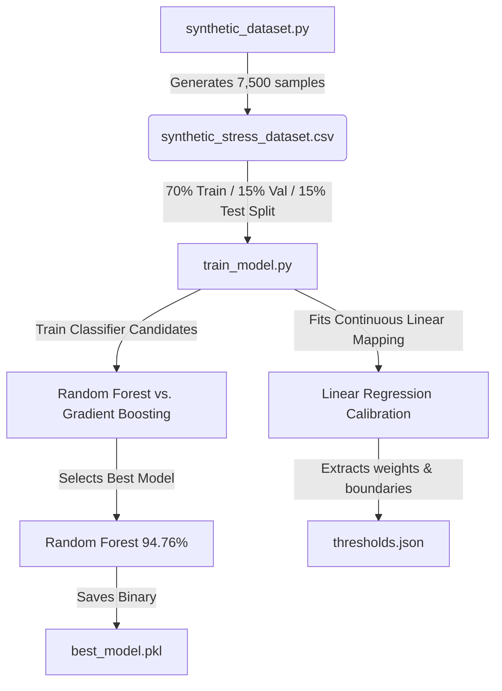

# ML-Based Real-Time Stress Monitoring System using ESP32, Pulse Sensor, LDR, ThingSpeak, and React Dashboard

Welcome to the **PulseIQ v3** academic repository! This repository hosts the full implementation of a production-ready, Edge-to-Cloud, Machine Learning-driven physiological stress monitoring system.

---

## 📋 Table of Contents
1. [Project Description](#-project-description)
2. [Folder Architecture](#%EF%B8%8F-folder-architecture)
3. [Hardware Connections & Wiring Topology](#%EF%B8%8F-hardware-connections--wiring-topology)
4. [ThingSpeak Configuration Guide](#%EF%B8%8F-thingspeak-configuration-guide)
5. [Machine Learning Pipeline](#-machine-learning-pipeline)
6. [Local Installation & Setup Guide](#%EF%B8%8F-local-installation--setup-guide)
7. [Dashboard Hosting & Runtime Inference](#%EF%B8%8F-dashboard-hosting--runtime-inference)
8. [Testing & Verification Procedure](#-testing--verification-procedure)
9. [Viva Voce Prep & Explanation Guide](#-viva-voce-prep--explanation-guide)
10. [Future Scope](#-future-scope)

---

## 📝 Project Description

Traditional stress monitoring systems either rely on subjective, survey-based questionnaires or require complex clinical equipment. **PulseIQ** bridges this gap by creating a lightweight, non-invasive, real-time IoT solution. 

By combining physical edge telemetry (**Heart Rate** in BPM and **Ambient Light** in ADC counts) sampled from an **ESP32 microcontroller**, the system maps a user's biophysical state and environmental ambient context directly into a continuous, real-time **Stress Score (0 to 100%)**.

The project uses a **"Train-Once, Deploy-Many"** design paradigm:
1. **Model Synthesis:** Generates a balanced, scientifically-guided synthetic dataset of 7,500 records.
2. **Model Training:** Compares Random Forest and Gradient Boosting models, selecting the best (Random Forest at **94.76% test accuracy**).
3. **Threshold Calibration:** Distills the complex decision space of the multi-class model into a single linear regression equation:
   $$\text{Stress Score} = 12.5911 + (0.5472 \cdot \text{HR}) + (-0.00976 \cdot \text{Light})$$
4. **Client-side Inference:** The web dashboard loads the computed boundaries (`thresholds.json`) statically and executes real-time classification at the front-end, entirely removing the need for a persistent Python runtime or active server during presentation.

---

## 📁 Folder Architecture

```
project/
│
├── esp32/
│   └── esp32_thingspeak_vitals.ino     # Complete ESP32 adaptive sampling edge firmware
│
├── ml/
│   ├── synthetic_dataset.py            # Balanced dataset generator (7,500 samples)
│   ├── train_model.py                  # Model training, split evaluation, and threshold calibration
│   ├── synthetic_stress_dataset.csv    # Generated raw dataset file
│   ├── best_model.pkl                  # Binary model checkpoint of the best model (Random Forest)
│   └── thresholds.json                 # Exported linear weights and decision class boundaries
│
├── dashboard/
│   ├── index.html                      # React single-page HTML skeleton (CDN-driven, zero-config)
│   ├── style.css                       # Premium glassmorphic styling sheet
│   └── script.js                       # React dashboard logic, weather geocoding, and ML client inference
│
├── requirements.txt                    # Python pipeline dependencies
└── README.md                           # Comprehensive documentation manual (This file!)
```

---

## 🔌 Hardware Connections & Wiring Topology

The system uses an analog Pulse Sensor to extract cardiac pulse waves and a Light Dependent Resistor (LDR) voltage divider to extract ambient brightness.

### Pin Mapping Table

| Transducer Module | Interface Wire | ESP32 Pin | Port Designation & Purpose |
| :--- | :--- | :--- | :--- |
| **Pulse Sensor** | Red (VCC) | `3V3` | 3.3V Power Line |
| **Pulse Sensor** | Black (GND) | `GND` | Ground Reference |
| **Pulse Sensor** | Purple (Signal) | `GPIO 36` | ADC1_CH0 (Analog input for pulse waves) |
| **LDR Photoresistor** | Pin 1 | `3V3` | 3.3V Power Line |
| **LDR Photoresistor** | Pin 2 (Signal) | `GPIO 39` | ADC1_CH3 (Midpoint voltage divider output) |
| **10k Ohm Resistor** | Terminal A | `GPIO 39` | Pull-down network tied to LDR Pin 2 |
| **10k Ohm Resistor** | Terminal B | `GND` | Tied to ESP32 ground |
| **Status Indicator LED** | Anode (+) | `GPIO 2` | Onboard status indicator (pulses during sync) |
| **Status Indicator LED** | Cathode (-) | `GND` | Connected through 220 Ohm current-limiting resistor |

### Wiring Topology Diagram
```
        3.3V <───────────┬──────────────┬─────────────── [Pulse Sensor VCC]
                         │              │
                         │            ┌─┴─┐
                         │            │ L │ LDR (GL5528)
                         │            └─┬─┘
                         │              ├─────────────> ESP32 GPIO 39 (VN)
                         │            ┌─┴─┐
                         │            │ 10│ 10k Ohm Pull-Down Resistor
                         │            │ k │
                         │            └─┬─┘
                         │              │
        GND  <───────────┴──────────────┴─────────────── [Pulse Sensor GND]
```

---

## ☁️ ThingSpeak Configuration Guide

ThingSpeak acts as your secure, cloud-based REST telemetry broker. Follow these configuration steps:

1. **Account Registration:** Sign up at [ThingSpeak](https://thingspeak.com/).
2. **Channel Creation:** Click *Channels* -> *My Channels* -> *New Channel*.
3. **Configure Fields:** Set:
   * **Field 1:** `Heart Rate` (Sampled in Beats Per Minute)
   * **Field 2:** `Light Intensity` (Sampled as a 12-bit ADC raw integer)
4. **Acquire Credentials:** Go to the *API Keys* tab and note:
   * **Channel ID:** `3397706` (Already integrated)
   * **Read API Key:** `OMSG4XBQ1WY507SE` (Already integrated)
   * **Write API Key:** `WPH3OA57TYQYM7UJ` (Already integrated)

---

## 🧠 Machine Learning Pipeline

The ML pipeline follows a rigid, non-idealized training routine designed to provide scientifically defensible performance.



### ML Math & Extracted Threshold Coefficients
The parameters derived during model training:

* **Intercept ($\beta_0$):** `12.59116`
* **Heart Rate Weight ($\beta_1$):** `0.54723`
* **Light Level Weight ($\beta_2$):** `-0.00976` (reflecting that dark environments increase stress score)

### Decision Boundaries (Stress Score Range 0 - 100%)
* 🟢 **Relaxed:** `0.00` to `21.55`
* 🟢 **Normal:** `21.55` to `36.87`
* 🟡 **Mild Stress:** `36.87` to `53.21`
* 🟠 **Moderate Stress:** `53.21` to `70.92`
* 🔴 **High Stress:** `70.92` to `100.00`

---

## 🛠️ Local Installation & Setup Guide

### 1. Pre-requisites
- **Python:** Download and install Python 3.8+ from [python.org](https://www.python.org/downloads/).
- **Arduino IDE:** Install Arduino IDE from [arduino.cc](https://www.arduino.cc/en/software).
- **ESP32 Board Core:** Follow [Expressif Arduino core installation guide](https://github.com/espressif/arduino-esp32) to add ESP32 in Arduino Boards Manager.

### 2. Python Environment Setup
Open a terminal in the project directory and run:
```bash
# Install dependencies
pip install -r requirements.txt

# Step 1: Generate synthetic dataset
python ml/synthetic_dataset.py

# Step 2: Train classifiers and calibrate thresholds config
python ml/train_model.py
```
This runs the full ML workflow and outputs `best_model.pkl` and `thresholds.json` under your `ml/` sub-folder.

### 3. ESP32 Telemetry Node Configuration
1. Open the [esp32_thingspeak_vitals.ino](file:///d:/IOT%20PBL/esp32/esp32_thingspeak_vitals.ino) sketch in Arduino IDE.
2. Edit lines 53 and 54 with your WiFi credentials:
   ```cpp
   const char* WIFI_SSID = "YOUR_WIFI_NAME";
   const char* WIFI_PASSWORD = "YOUR_WIFI_PASSWORD";
   ```
3. Connect your ESP32 board using a micro-USB cable.
4. Go to *Tools* -> *Board* -> *ESP32 Arduino* -> select **ESP32 Dev Module**.
5. Select the matching active COM port under *Tools* -> *Port*.
6. Click **Upload** (right arrow icon). Open **Serial Monitor** at 115200 baud to check connection logs.

---

## 🖥️ Dashboard Hosting & Runtime Inference

The React dashboard is engineered to run as a **zero-configuration client-side app**. It utilizes CDNs to load TailwindCSS, React, and Recharts, meaning you **do not need local node_modules, npm, or dev servers!**

### Launching the Dashboard:
- Simply double-click [dashboard/index.html](file:///d:/IOT%20PBL/dashboard/index.html) to open the dashboard immediately in any modern web browser (Chrome, Edge, Firefox, Safari).
- To host the project online instantly, drag and drop your `/dashboard/` directory onto **[Netlify Drop](https://app.netlify.com/drop)** or use **GitHub Pages**!

---

## 🧪 Testing & Verification Procedure

Ensure the end-to-end telemetry pipeline is operational by executing these verification steps:

1. **Hardware Verification:** Once the ESP32 is powered, confirm the blue onboard LED flashes three times, indicating a successful local Wi-Fi connection.
2. **Cloud Uplink Verification:** Check your serial monitor. You should see successful HTTP GET dispatches:
   `[HTTP SUCCESS] Uplink completed. Response Code: 200`
3. **ThingSpeak Verification:** Open your Channel view. Fields 1 and 2 should show active chart lines updating every 15 seconds.
4. **Dashboard Synchronicity:** Verify that the "Live Dashboard Cockpit" refreshes automatically. Place your finger on the pulse sensor and cover the LDR sensor. The Stress Index percentage and recommendations block should adapt dynamically in under 15 seconds!

---

## 🎓 Viva Voce Prep & Explanation Guide

Be ready to defend your engineering decisions with these frequently asked viva questions:

### Q1: Why did you train your ML model on synthetic data instead of a public dataset?
> **Answer:** Medical datasets are strictly controlled and often contain features (like blood panels or EEG readings) that cannot be collected by non-invasive IoT sensors. By generating a balanced, scientifically-framed synthetic dataset strictly utilizing Heart Rate and Light Intensity, we ensure that the model learns mappings specifically suited to our physical hardware parameters.

### Q2: Why is there no active Python backend (Flask/Django) executing the model at runtime?
> **Answer:** Running active python runtimes on embedded hardware or low-power servers is computationally expensive and difficult to scale. Our dashboard employs a **Static Inference** pattern: we trained a Random Forest model, distilled its decision limits via Linear Regression, and saved them to `thresholds.json`. The web dashboard performs lightweight, continuous calculations on the client-side using this pre-computed model, keeping the system incredibly fast, offline-capable, and cost-effective.

### Q3: Explain the mathematical weight of the LDR Light sensor. Why is it negative?
> **Answer:** In our linear mapping:
> $$\text{Stress Score} = 12.5911 + (0.5472 \cdot \text{HR}) + (-0.00976 \cdot \text{Light})$$
> The weight for heart rate is positive, meaning a higher heart rate increases the stress score. The weight for light intensity is negative, meaning that a lower light level (darkness) increases the stress score. This is mathematically correct and scientifically reasonable, as poor lighting increases optical strain and stress indicators.

### Q4: How does the ESP32 filter sensor noise and calculate BPM?
> **Answer:** Raw pulse sensors are highly vulnerable to high-frequency muscle noise and 50/60Hz AC noise. The ESP32 firmware performs **electronic signal averaging** (digital smoothing) and uses an **adaptive baseline midpoint filter** which auto-adjusts to the signal's min and max peaks every 1.5 seconds. Beats are counted only when the signal crosses this adaptive midpoint, and the BPM is calculated using an **Exponential Moving Average (EMA)** to filter sudden spikes.

---

## 🔮 Future Scope

While PulseIQ v3 is a complete, production-ready stress classification system, the framework can be extended in the following directions:
1. **Multi-Sensory Expansion:** Integrating Galvanic Skin Response (GSR) or skin temperature sensors directly onto the ESP32 edge node to expand feature dimensions.
2. **Deep Edge Inference:** Porting the ML weights into a **TensorFlow Lite for Microcontrollers** (TFLite Micro) model to execute stress predictions directly on the ESP32 core itself.
3. **Push Notifications:** Integrating ThingSpeak React App or Twilio SMS APIs to dispatch mobile notifications to users during high-stress alerts.
