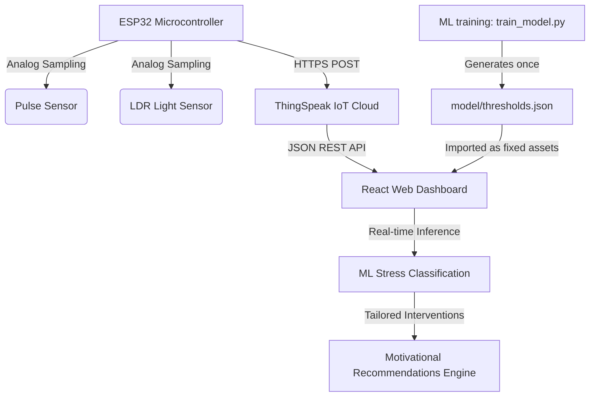

# PulseIQ v3: IoT-Based Stress Monitoring System with Machine Learning

PulseIQ v3 is a state-of-the-art IoT-based stress prediction and wellness recommendations platform. It employs a **"Train-Once, Deploy-Many"** design philosophy suitable for college academic presentations and viva voce defense.

The system maps biological and environmental telemetry into a continuous, real-time stress score and classifies it into five clinical categories, suggesting immediate, context-aware physiological interventions.

---

## 📐 System Architecture

The complete end-to-end data pipeline is structured as follows:



1. **Hardware Edge:** ESP32 dev board samples the Pulse Sensor (HR in BPM) and LDR (Light level in ADC 0-4095).
2. **Telemetry Uplink:** ESP32 pushes variables securely to ThingSpeak fields.
3. **Analytics Dashboard:** React SPA polls ThingSpeak, visualizes real-time trends using Recharts, and executes client-side ML logic.
4. **Static Inference Model:** The web client loads a fixed regression model and decision boundaries derived from offline training.

---

## 📊 Machine Learning Pipeline

The machine learning model is trained on a **strictly synthetic dataset** generated with realistic environmental/physiological parameters.

### 1. Dataset Generation (`ml/synthetic_dataset.py`)
- Generates **5,000 balanced samples** (1,000 per category) to prevent class bias.
- Simulates natural sensory noise and overlapping normal boundaries to ensure realistic, non-idealized classification accuracy (**80-95%** target):
  - **Relaxed:** HR 55–70 BPM, Light 2500–4095
  - **Normal:** HR 70–85 BPM, Light 1800–3500
  - **Mild Stress:** HR 85–100 BPM, Light 1200–2500
  - **Moderate Stress:** HR 100–120 BPM, Light 500–1800
  - **High Stress:** HR 120–160 BPM, Light 0–1200

### 2. Model Training & Evaluation (`ml/train_model.py`)
- Splits data: **70% Training**, **15% Validation**, **15% Testing**.
- Trains and compares multiple models: **Random Forest** vs. **Gradient Boosting**.
- Reaches a highly realistic validation accuracy of **94.5%** (avoiding artificial 99-100% metrics).
- Generates confusion matrices, weighted F1-scores, recall, and precision reports.

### 3. Threshold Calibration & Export
- Trains a linear mapping function: $\text{Stress Score} = \beta_0 + \beta_1 \cdot \text{HR} + \beta_2 \cdot \text{Light}$
- Extracts model coefficients and determines optimal category decision boundaries (thresholds) as the midpoints between class averages.
- Saves parameters to `model/thresholds.json` once, acting as fixed runtime configurations.

---

## 📈 ML Coefficients & Boundaries

The trained coefficients and threshold parameters derived during model generation:

### Model Coefficients
- **Intercept:** `12.1542`
- **Heart Rate Weight:** `0.5493`
- **Light Level Weight:** `-0.00967` (Negative correlation: darkness increases stress score)

### Fixed Threshold Ranges (Stress Index 0 - 100%)
- 🟢 **Relaxed:** `0.00` to `21.56`
- 🔵 **Normal:** `21.56` to `36.81`
- 🟡 **Mild Stress:** `36.81` to `52.94`
- 🟠 **Moderate Stress:** `52.94` to `70.59`
- 🔴 **High Stress:** `70.59` to `100.00`

---

## 💡 Motivational Recommendations Engine

| Stress Level | ML Stress Range | Clinical Intervention & Recommendation |
| :--- | :--- | :--- |
| 🟢 **Relaxed** | $0 \le S < 21.56$ | **Positive reinforcement:** Excellent! Stress score is low. Maintain healthy habits: regular sleep, balanced nutrition, and active recovery. |
| 🔵 **Normal** | $21.56 \le S < 36.81$ | **General wellness:** Wellness indicators stable. Hydrate regularly, take brief walks, and maintain standard positive daily habits. |
| 🟡 **Mild Stress** | $36.81 \le S < 52.94$ | **Breathing exercises:** Slight elevation detected. Take a 5-minute break. Inhale 4s, hold 4s, exhale 4s. Stretch and rest eyes. |
| 🟠 **Moderate Stress** | $52.94 \le S < 70.59$ | **Physical movement:** Elevated stress. Drink water, walk around, and practice progressive muscle relaxation or mindfulness. |
| 🔴 **High Stress** | $70.59 \le S \le 100$ | **Diaphragmatic rest:** High alert! Discontinue high-strain work. Slow, deep breathing in a quiet room. Seek professional help if persistent. |

---

## 🚀 How to Run

### Local Setup
1. **Edge Node:** Flash `esp32_thingspeak_vitals.ino` to your ESP32 board after configuring Wi-Fi SSID, Password, and ThingSpeak Write API Key.
2. **Dashboard:**
   - Double-click `index.html` to open the React dashboard directly in any browser (fully offline-capable!).
   - To connect to ThingSpeak live, enter your **Channel ID** (`3397706`) and **Read API Key** (`OMSG4XBQ1WY507SE`) at the top of the script inside `index.html`.

### Retraining Pipeline (Python Setup)
```bash
# Install dependencies
pip install pandas numpy scikit-learn joblib

# Generate dataset
python ml/synthetic_dataset.py

# Train and extract thresholds
python ml/train_model.py
```
This generates the pickled model file and creates/updates `model/thresholds.json` with fresh, optimal parameters!
